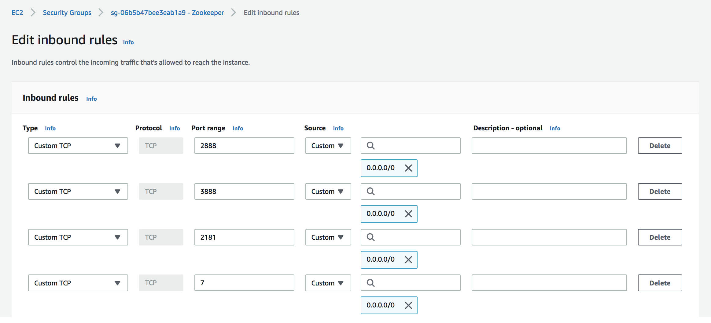

# accumulo-hdfs-zookeeper

Create a storage cluster on AWS (or any other Cloud) running Apache Accumulo on Hadoop DFS (HDFS) and Zookeeper for node management.

In the first part of this project we will set up a 3-node cluster to install, configure, and run Accumulo, HDFS, and Zookeeper on each node and of course, have each application communicate with each other. In doing so, we will leverage an earlier project (https://github.com/spineo/hadoop-app) I created involving 3 AWS instances (Amazon Linux t2.micro 64-bit (x86)) which we will upgrade to t2.medium to cover the additional resource utilization.

In the second part of the project we will develop a simple Java client to interact directly with Accumulo/HDFS.

## Change the Instance Types

In the AWS console we will be selecting the _HadoopMainNode_ and then go to _Actions -> Instance Settings -> Change Instance Type_, select _t2.medium_, and click "Apply" (once we get ready to set up the applications on the remaining nodes we can similarly apply this action to the _HadoopDataNode1_ and _HadoopDataNode2_ instances). Note that the instance(s) must be stopped first before applying this action (I would generally recommend that instances be stopped when not in use as AWS charges can quickly skyrocket!)

## Install/Configure Zookeeper on the Main Node

We will start out by installing, configuring, and testing Zookeeper on the _HadoopMainNode_ and then complete the installation/configuration to include the remaining two nodes.


### Set up the User and Deploy the Application


Log into the main node and as _ec2-user_ (or any user with _sudo_ privileges) run the below commands to setup our 
_zookeeper_ user:
```
sudo useradd zookeeper -m
sudo usermod --shell /bin/bash zookeeper
sudo passwd zookeeper
```

Create the data directory by running below commands:
```
sudo mkdir -p /data/zookeeper
sudo chown zookeeper:zookeeper /data/zookeeper
```

We will now download/install the binary in the same location where we installed Hadoop (i.e., /var/applications) and will use the latest stable release from https://zookeeper.apache.org/releases.html#download by running below commands:
```
cd /var/applications
sudo su
wget https://downloads.apache.org/zookeeper/zookeeper-3.6.0/apache-zookeeper-3.6.0-bin.tar.gz
tar -xvf apache-zookeeper-3.6.0-bin.tar.gz
chown -R zookeeper:zookeeper apache-zookeeper-3.6.0-bin
ln -s apache-zookeeper-3.6.0-bin zookeeper
chown -h zookeeper:zookeeper zookeeper
```

If all goes well, remove the installation binary: _rm apache-zookeeper-3.6.0-bin.tar.gz_

Finally, we will confirm that our _java_ dependency being used is the correct one:
```
[zookeeper@ip-xxx-xxx-xxx-xxx zookeeper]$ java -version
openjdk version "1.8.0_222"
OpenJDK Runtime Environment (build 1.8.0_222-b10)
OpenJDK 64-Bit Server VM (build 25.222-b10, mixed mode)
```

### Configure the Application

Run the below commands as user _zookeeper_ (you can first run _export ZOOKEEPER_HOME=/var/applications/zookeeper_ or add this statement to your ~/.bashrc)
```
cd $ZOOKEEPER_HOME/conf
cp zoo_sample.cfg zoo.cfg
```
and edit the _zoo.cfg_ file to include the below parameters (all except _dataDir_ are likely default):
```
# The number of milliseconds of each tick
tickTime=2000

# The number of ticks that the initial 
# synchronization phase can take
initLimit=10

# The number of ticks that can pass between 
# sending a request and getting an acknowledgement
syncLimit=5

# the directory where the snapshot is stored.
# do not use /tmp for storage, /tmp here is just 
# example sakes.
dataDir=/data/zookeeper

# the port at which the clients will connect
clientPort=2181

# the maximum number of client connections.
# increase this if you need to handle more clients
#maxClientCnxns=60
```

### Start the Application

Run the below commands:
```
cd $ZOOKEEPER_HOME
./bin/zkServer.sh start
```
and you should see output similar to below (in this case no need to specify our config file):
```
/bin/java
ZooKeeper JMX enabled by default
Using config: /var/applications/zookeeper/bin/../conf/zoo.cfg
Starting zookeeper ... STARTED
```

You can also check the status as shown below and verify the _standalone_ mode.
```
[zookeeper@ip-xxx-xxx-xxx-xxx zookeeper]$ ./bin/zkServer.sh status
/bin/java
ZooKeeper JMX enabled by default
Using config: /var/applications/zookeeper/bin/../conf/zoo.cfg
Client port found: 2181. Client address: localhost.
Mode: standalone
```

We can now test connecting to our server running locally through the CLI (we can ignore most of the verbose output but if successful should see at the end a line containing _WatchedEvent state:SyncConnected_):
```
./bin/zkCli.sh -server 127.0.0.1:2181
```
If we type any command (i.e., help) it should list the available CLI commands and we can type _quit_ when done:
```
[zk: 127.0.0.1:2181(CONNECTED) 0] help
ZooKeeper -server host:port cmd args
	addWatch [-m mode] path # optional mode is one of [PERSISTENT, PERSISTENT_RECURSIVE] - default is PERSISTENT_RECURSIVE
	addauth scheme auth
	close 
	config [-c] [-w] [-s]
	connect host:port
	create [-s] [-e] [-c] [-t ttl] path [data] [acl]
	delete [-v version] path
	deleteall path [-b batch size]
	delquota [-n|-b] path
	get [-s] [-w] path
	getAcl [-s] path
	getAllChildrenNumber path
	getEphemerals path
	history 
	listquota path
	ls [-s] [-w] [-R] path
	printwatches on|off
	quit 
	reconfig [-s] [-v version] [[-file path] | [-members serverID=host:port1:port2;port3[,...]*]] | [-add serverId=host:port1:port2;port3[,...]]* [-remove serverId[,...]*]
	redo cmdno
	removewatches path [-c|-d|-a] [-l]
	set [-s] [-v version] path data
	setAcl [-s] [-v version] [-R] path acl
	setquota -n|-b val path
	stat [-w] path
	sync path
	version 
```

Likewise, we can stop the server as we get ready to set up the _systemd_ configuration:
```
[zookeeper@ip-xxx-xxx-xxx-xxx zookeeper]$ ./bin/zkServer.sh stop
/bin/java
ZooKeeper JMX enabled by default
Using config: /var/applications/zookeeper/bin/../conf/zoo.cfg
Stopping zookeeper ... STOPPED
```

## Setting up _systemd_ (Optional)

Create a new file _/etc/systemd/system/zookeeper.service_ with the below contents:
```
[Unit]
Description=Zookeeper Daemon
Documentation=http://zookeeper.apache.org
Requires=network.target
After=network.target

[Service]    
Type=forking
WorkingDirectory=/opt/zookeeper
User=zookeeper
Group=zookeeper
ExecStart=/opt/zookeeper/bin/zkServer.sh start /opt/zookeeper/conf/zoo.cfg
ExecStop=/opt/zookeeper/bin/zkServer.sh stop /opt/zookeeper/conf/zoo.cfg
ExecReload=/opt/zookeeper/bin/zkServer.sh restart /opt/zookeeper/conf/zoo.cfg
TimeoutSec=30
Restart=on-failure

[Install]
WantedBy=default.target
```

Start the daemon by running _systemctl start zookeeper_ and then _systemctl status zookeeper_ prefixed with _sudo_ if not root (you can verify that daemon is running from status output):
```
● zookeeper.service - Zookeeper Daemon
   Loaded: loaded (/etc/systemd/system/zookeeper.service; disabled; vendor preset: disabled)
   Active: active (running) since Thu 2020-04-30 16:20:15 UTC; 8s ago
     Docs: http://zookeeper.apache.org
  Process: 3884 ExecStart=/var/applications/zookeeper/bin/zkServer.sh start /var/applications/zookeeper/conf/zoo.cfg (code=exited, status=0/SUCCESS)
 Main PID: 3900 (java)
   CGroup: /system.slice/zookeeper.service
           └─3900 java -Dzookeeper.log.dir=/var/applications/zookeeper/bin/../logs -Dzookeeper.log.file=zookeeper-zookeeper-server-ip-xxx-xxx-xxx-xxx.ec2.internal.log -Dzookeeper.root.logger=IN...

Apr 30 16:20:14 ip-xxx-xxx-xxx-xxx.ec2.internal systemd[1]: Starting Zookeeper Daemon...
Apr 30 16:20:14 ip-xxx-xxx-xxx-xxx.ec2.internal zkServer.sh[3884]: /usr/bin/java
Apr 30 16:20:14 ip-xxx-xxx-xxx-xxx.ec2.internal zkServer.sh[3884]: ZooKeeper JMX enabled by default
Apr 30 16:20:14 ip-xxx-xxx-xxx-xxx.ec2.internal zkServer.sh[3884]: Using config: /var/applications/zookeeper/conf/zoo.cfg
Apr 30 16:20:15 ip-xxx-xxx-xxx-xxx.ec2.internal systemd[1]: Started Zookeeper Daemon.
```

Finally, run command to enable startup on boot:
```
[root@ip-xxx-xxx-xxx-xxx apache-zookeeper-3.6.0-bin]# systemctl enable zookeeper
Created symlink from /etc/systemd/system/default.target.wants/zookeeper.service to /etc/systemd/system/zookeeper.service.
```

and try _systemctl stop zookeeper_ followed by _systemctl restart zookeeper_ (and check status one more time)

## Set up the Zookeeper Cluster

We will now be following the preceding installation and configuration steps on the two remaining cluster nodes (_HadoopDataNode1_ and _HadoopDataNode2_) but before we get started, we will ensure that our instances type have been changed to _t2.medium_, we will need to open some ports used in the communication between nodes, and of course, start the instances.

### Opening the Ports

The new instance creation in AWS by default, sets up security rules for inbound SSH access (port 22) and outbound access on all TCP ports. Since we will be using the default Zookeeper ports (2181, 2888, and 3888), if we decide on locked down port security we will need to create a security group that enables inbound access rules specifically on these ports (as well as port 7 which is used for echo). Screenshot below shows an example setup with restricted port but unrestricted IP access.



To create the security group, on the _EC2 Dashboard_ click on _Security groups_ and then the _Create security group_ button. Give it a name (i.e., Zookeeper) and optional description and save the changes (bottom right) once the rules have been added.

Then go back to the _Running instances_ dashboard and for each of our instances, navigate to _Actions -> Networking -> Change Security Groups_, select the security group just created, and click on _Assign Security Groups_.

### Edit the Configuration

Once we get to the section where we edit the _zoo.cfg_ file, we will add the below three lines to all of them (including the main node one). The server value can be the public DNS or IP.
```
server.1=ec2-xxx-xxx-xxx-xxx.compute-1.amazonaws.com:2888:3888
server.2=ec2-xxx-xxx-xxx-xxx.compute-1.amazonaws.com:2888:3888
server.3=ec2-xxx-xxx-xxx-xxx.compute-1.amazonaws.com:2888:3888  
```

Then on each node create a _/data/zookeeper/myid_ file containing the server number associated with that node (i.e., on server.1 node the myid file would contain the number _1_).

### Start up Each Node

As before, if you have _systemd_ set up on the remaining nodes you can use _systemctl start zookeeper_ but if not:
```
sudo su zookeeper
cd $ZOOKEEPER_HOME
./bin/zkServer.sh start
```

### Test Connecting to Other Nodes
As before, we can use the CLI to test connectivity on other nodes by specifying the Public DNS (or IP) and configured port number:
```
./bin/zkCli.sh -server ec2-xxx-xxx-xxx-xxx.compute-1.amazonaws.com:2181
```

### Test Operational Status of the Cluster
To check the operational status of the cluster, we can determine first which of the three nodes is the _leader_ and which are _followers_. If leader, you will get the following status when running the below command:
```
[zookeeper@ip-xxx-xxx-xxx-xxx zookeeper]$  ./bin/zkServer.sh status
/bin/java
ZooKeeper JMX enabled by default
Using config: /var/applications/zookeeper/bin/../conf/zoo.cfg
Client port found: 2181. Client address: localhost.
Mode: leader
```
Similarly, if follower you will see _Mode: follower_ in the output.

The below command and output executed from the leader node can be used to confirm whether the leader is syncing with  followers:
```
[zookeeper@ip-xxx-xxx-xxx-xxx zookeeper]$ echo mntr | nc localhost 2181 | grep followers
zk_synced_followers	2
zk_synced_non_voting_followers	0
```

A couple of things you might need to do on the leader node before you run the above command:
* Run _yum install nc_ (as _root_ user or _sudo_) if application is not pre-installed
* You will need to restart the zookeeper daemon by passing it a JVM argument. This can be done as shown below:
```
SERVER_JVMFLAGS=-Dzookeeper.4lw.commands.whitelist=mntr ./bin/zkServer.sh restart
```

## Install/Configure Accumulo

I will not be creating an _accumulo_ user for this exercise but rather run the full installation as _root_ user (though it is probably recommended to create the dedicated user) and I will be installing the latest version available found on the official [downloads](https://accumulo.apache.org/downloads/) page.


### Install on the Main Node

Log into the _HadoopMainNode_ and run the following commands:
```
cd /var/applications
wget http://us.mirrors.quenda.co/apache/accumulo/2.0.0/accumulo-2.0.0-bin.tar.gz
tar xvf accumulo-2.0.0-bin.tar.gz
ln -s accumulo-2.0.0 accumulo
```

### Start Up the Zookeeper Cluster (if not already up)

As _zookeeper_ user, on each node run the _start_ comand followed by _status_ to ensure that service is up in cluster mode (if needed, ensure that the correct Public DNS or IP) values are coded in the _conf/zoo.cfg_ file):
```
cd /var/applications/zookeeper
./bin/zkServer.sh start
./bin/zkServer.sh status
```

### Start Up the HDFS Cluster (if not already up)

Please refer to [this](https://github.com/spineo/hadoop-app) page for specifics, especially if the config files located under $HADOOP_HOME/etc/hadoop and ~/.ssh/config require modifications (usually if the Public DNS or IP values have changed)

As _hadoop_ user, on the _HadoopMainNode_ run the following commands:
```
cd /var/applications/hadoop
./sbin/start-all.sh
```

The above command will execute _start-dfs.sh_ and _start-yarn.sh_. Any problems with startup will generally be displayed in the console or logged in more detail under $HADOOP_HOME/logs. Once startup completes, you can verify that both the DFS Health UI (http://<HadoopMainNode>:50070/dfshealth.html#tab-datanode/) and the YARN UI (http://<HadoopMainNode>:8088/cluster/nodes/) render and display the two active data nodes.


## Run the Test Application


## References
* https://zookeeper.apache.org/releases.html
* https://www.digitalocean.com/community/tutorials/how-to-install-and-configure-an-apache-zookeeper-cluster-on-ubuntu-18-04
